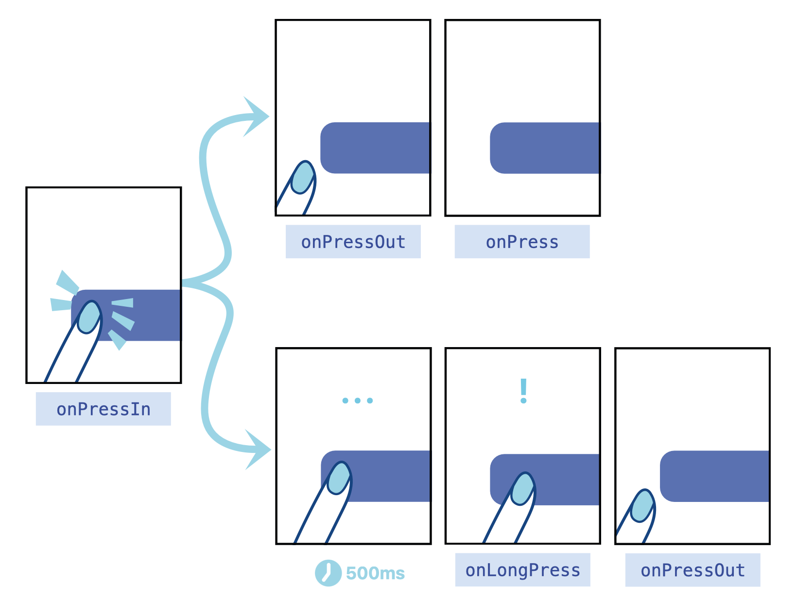

# RN 주요 컴포넌트 정리

리액트는 해봤지만, 리액트 네이티브는 처음이다! 익숙한 듯 다른 RN에서 몇가지 특징과 컴포넌트들을 알아보도록 하자. 리액트에 비해 RN의 공식문서가 매우 이해하기 쉬워 이를 참고하였다.! (공부하는 중이니 부정확할 수 있다) + Expo, functional component 기준으로 정리할 예정이다.

## Unit(pixel? dp?)

 `React Native are unitless, and represent density-independent pixels.` 라고 공식문서에 나와있다. 모바일 폰의 경우, 픽셀로 사이즈를 표현하면 핸드폰마다 화면의 크기는 비슷한데 픽셀의 크기는 종별로 차이가 크므로 나타나는 화면의 크기를 예상하기 어려워진다. 예를 들어, 화면의 크기가 같은 hd폰과 qhd폰의 픽셀은 4배차이가 나므로 픽셀로 표현한다면 한 컴포넌트의 **크기가 4배나 차이가 날 것이다**. 따라서 `dp`는 pixel per inch를 고려하여 큰 화면,작은 화면에 상관 없이 같은 크기로 나타나도록 한다. **<u>RN에서는 픽셀 대신 dp를 사용하며, 이는 단위를 생략하여 표현한다.</u>** 아 물론, % 단위의 표현도 가능하다.

## Style

RN에서는 css와 큰 틀에서는 같으나, id나 className을 통하여 스타일링을 하지 않는다. 다만, `StyleSheet.create()` 안에 스타일 객체를 넘겨주고, 이를 통하여 style property에 배열로 넘겨주면 된다! 어려우니, 예시를 살펴보자. 

```react
import React from "react";
import { StyleSheet, Text, View, } from "react-native";
import MyButton from "./components/MyButton";
export default function App() {
  const name = "eastsea";
  console.log("Expo DevTools Log Test");
  return (
    <View style={[styles.container, styles.bg_sky]}>	
      <Text>My Name is {name}</Text>
    </View>
  );
}

const styles = StyleSheet.create({
  container: {
    flex: 1,
    backgroundColor: "#fff",
    alignItems: "center",
    justifyContent: "center",
  },
  bg_sky: {
    backgroundColor: "skyblue",
  },
});

```

React와 크게 다른 점은 className, id가 없고, `style={{ }}`가 아닌 `style={[ ]}`라는 점인 것 같다. 또한 css 우선순위가 존재하지 않고, 뒤에 적용되는 속성으로 덮어씌워 질 것이다. 위의 코드에서 backgroundColor가 skyblue로 나오는 것처럼 말이다!


## Basic Component

### View (div)

### Text (p)

### Image (img)


 추가적으로 display 속성의 값이 flex와 none 두 가지 밖에 없다고 하며, nth-child 등과 같은 선택자 역시 사용할 수 없다.

## Pressable

web에 button, onClick 이 있다면, RN에는 Pressable, onPress가 있다. 물론 Button component도 있지만, 추가적으로 사용자와 인터렉션이 많은 모바일 환경에 맞게 추가된 것들이 존재한다.

- 터치 관련 이벤트 함수

  

  `onPress`는 터~!까지만이 아니라 터~치!까지 인거다. `onLongPress`에서 계속 누르고 있는 시간의 기준은 `delayLongPress`로 ms단위의 설정이 가능하다. 

- 버튼의 범위

  

  모바일에서는 사용자의 터치를 유연하게 받아들이기 위해 press로 인정되는 범위와, 벗어나면(누른상태로 손을 치우면) press로 인정하지 않는(취소되는) 범위가 존재한다.

  - `HitRect`(`hitSlop`으로 변경 가능) : 실제 Pressable의 영역보다 더 큰 영역으로, **터치가 인정되는 범위**이다.
  - `PressRect`(`pressRetentionOffset`으로 변경 가능) : 누른 상태로, 이 범위 밖으로 터치한 **손가락이 나가게 되면 onPress가 발생하지 않는다**.

### pressed 여부에 따른 스타일링

Pressable 내의 함수에서는 눌린 상태인지 여부를 나타내는 `pressed`에 접근할 수 있는 것 같다. 함수의 인자에 넘어오는 객체 중 `{pressed}`를 사용하면 된다. 손으로 누르면 pressed === true, 떼면 false가 된다. 이를 이용하여 눌렀을때의 스타일을 정해줄 수 있다.

여기까지 한번 해보자!! 버튼을 누를때마다 색(style)과 내용(Text)이 바뀌게 하고, 누른 횟수를 상태로 보여주도록 하였다. 추가적으로, 길게 눌러도 누른 횟수를 증가시키도록 해보자.!

```react
import React, { useState, useCallback } from "react";
import { StyleSheet, Text, Pressable } from "react-native";

const MyButton = () => {
  const [pressCnt, setPressCnt] = useState(0);
  const countPlus = useCallback(() => {
    setPressCnt((pressCnt) => pressCnt + 1);
  }, []);
  return (
    <Pressable
      onPress={countPlus}
      onLongPress={countPlus}
      style={({ pressed }) => [
        {
          backgroundColor: pressed ? "#3498db" : "white",
        },
        styles.normalbtn,
      ]}
    >
      {(
        { pressed } //event 객체를 인자로 하는 익명 함수 이용 가능
      ) => (
        <Text style={{ fontSize: 24, color: "black" }}>
          {pressed ? "Pressed! : " : "Press Me! : "}
          {pressCnt}
        </Text>
      )}
    </Pressable>
  );
};
const styles = StyleSheet.create({
  normalbtn: {
    padding: 16,
    margin: 10,
    borderRadius: 8,
  },
  pressIn: {
    backgroundColor: "grey",
  },
  text: {
    fontSize: 30,
  },
});
export default MyButton;

```


추가적으로 TouchableHighlight라는 컴포넌트를 사용하면 이러한 스타일링을 편하게 할 수 있지만, 공식적으로 Pressable을 밀고 있는 듯 보인다. 그치만 일일이 구현해야하는 귀찮음이 있으므로 `TouchableHighlight`, `TouchableOpacity`, `TouchableWithoutFeedback`의 이름 정도는 알고 있도록 하자.

## ScrollView VS FlatList

Android에서도 ScrollView와 RecyclerView의 차이와 비슷하다.


노치 있는 아이폰 위하여 **SafeAreaView** 존재

